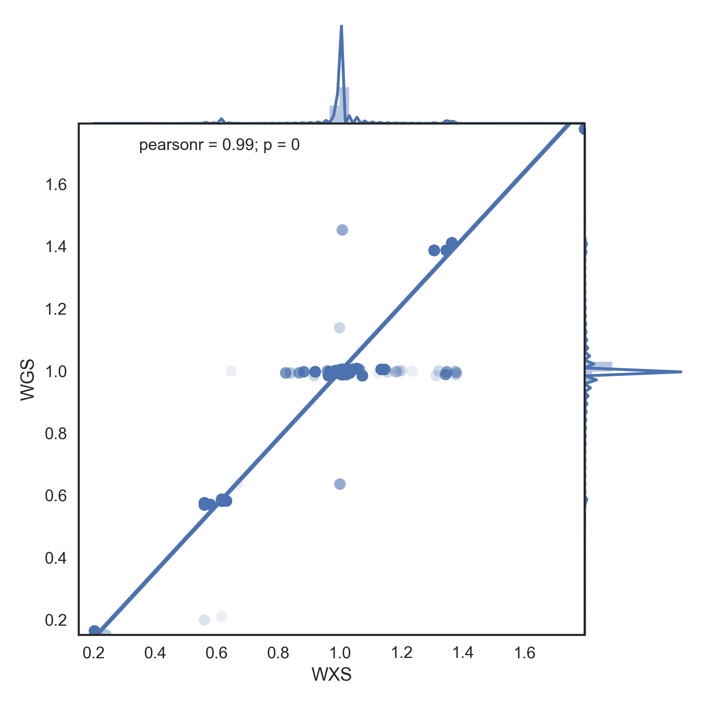

# cnvplot
CNV quality control of WXS and WGS through visulization

## Requirements
- Python 3.6
- HTSeq
- scipy
- pandas
- seaborn
- matplotlib

## Genome level CNV plot
```bash
python plot_genome_cnv.py -c hg19.fa.fai -x wxs.cnv -g wgs.CNV -w 10000
```


## Correlation plot
```
python sample_cnv.py -c hg19.fa.fai -x wxs.cnv -g wgs.CNV -r 2 -s 100000
```

Correlation plot 100,000 points round 1| Correlation plot 100,000 points round 2
:-------------------------------------:|:---------------------------------------:
              | 
